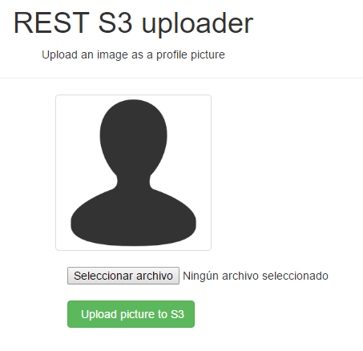
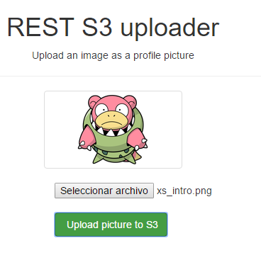

# Angular S3 Uploader

An example on how to upload images to Amazon S3 using the javascript SDK, and retrieve them using CloudFront CDN.

## Screenshots




## Dependencies

You will need an AWS account to create an S3 bucket and a CloudFront distribution, with you bucket as an origin. Free tier would be enough to run this example. You also need an IAM user with ONLY the S3 PutObject Action.

## Installation

To run this example, you will need to add CORS configuration and a policy to your bucket.

Your CORS configuration should look like this:

```xml
<?xml version="1.0" encoding="UTF-8"?>
<CORSConfiguration xmlns="http://s3.amazonaws.com/doc/2006-03-01/">
    <CORSRule>
        <AllowedOrigin>http://yourapp.com</AllowedOrigin> <!-- deploy -->
        <AllowedOrigin>http://yourapp.herokuapp.com</AllowedOrigin> <!-- staging -->
        <AllowedOrigin>http://localhost:3456</AllowedOrigin> <!-- development -->
        <AllowedMethod>PUT</AllowedMethod>
        <MaxAgeSeconds>3000</MaxAgeSeconds>
        <ExposeHeader>x-amz-server-side-encryption</ExposeHeader>
        <ExposeHeader>x-amz-request-id</ExposeHeader>
        <ExposeHeader>x-amz-id-2</ExposeHeader>
        <AllowedHeader>*</AllowedHeader>
    </CORSRule>
</CORSConfiguration>
```

You will also need to specify a policy if you want your images to be public. The policy should look like this:

```javascript
{
	"Version": "2012-10-17",
	"Id": "PolicyXXXXXXXXXXXX",
	"Statement": [
		{
			"Sid": "StmtXXXXXXXXXXXXX",
			"Effect": "Allow",
			"Principal": "*",
			"Action": "s3:GetObject",
			"Resource": "arn:aws:s3:::[your bucket name]]/images/*"
		}
	]
}

```

After that, you will need to configure the angular app. fill the blanks in `js/constants.js`. If you are not using ClodFront as a CDN, fill the cdn value with the adress of your bucket.

To run the example, upload it into a domain that was specified in the CORS configuration. If you are testing in local, start a SimpleHTTPServer with python and use `localhost:<port>` as your domain in CORS.

## Known Issues
* This example uses the Amazon javascript S3 SDK. Even when minified, it is still about 200 kb. Load it only on the pages you are going to use.

* Credentials are hard-coded in the client side. This is bad practice. Make sure your IAM user has only put permissions and double check your bucket policies to avoid further issues. 

## Questions or issues?7
Please feel free to ask or raise an issue in our issue page.